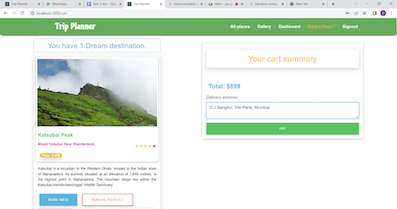

# Intelligent Tour Guide

## Overview

The **Intelligent Tour Guide System** is a revolutionary travel planning solution that offers personalized tour package recommendations based on users' location and budget preferences. It combines cutting-edge machine learning techniques with a user-friendly interface, providing a seamless experience for travelers. The system not only suggests tourist destinations but also recommends accommodations and activities tailored to user preferences like trekking, honeymoon, and more.

## Features

- **Personalized Tour Recommendations**: Receive suggestions for destinations, accommodations, and activities based on your preferences.
- **Budget-Aware**: The system provides recommendations within the user's specified budget.
- **Machine Learning Integration**: Utilizes algorithms like Cosine Similarity, Euclidean Distance, and Jaccard Similarity for recommendation.
- **Save and View Later**: Users can save preferred locations and view them later.
- **Categories**: Options to select specific trip types such as trekking, honeymoon, or religious tours.
- **Comprehensive Trip Planning**: Complete package from choosing the location to accommodations and activity recommendations.

## Technologies Used

- **Frontend**: 
  - React.js
  - Bootstrap
  
- **Backend**: 
  - Flask
  
- **Database**: 
  - MongoDB

- **Machine Learning Algorithms**:
  - Cosine Similarity
  - Euclidean Distance
  - Jaccard Similarity
 

 
  
  
  
  
  
  

